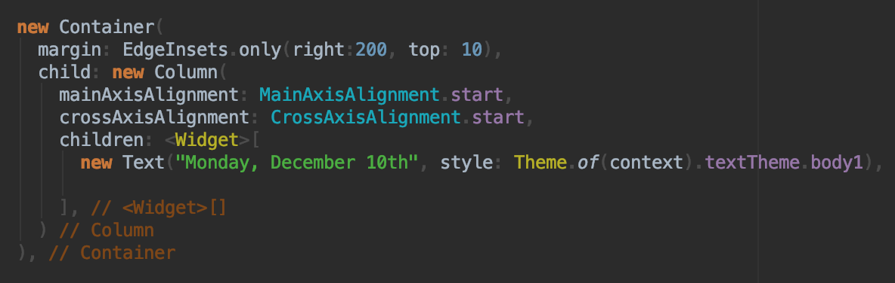

# MySettings
Repository of my dotfiles, settings files, and configuration files

## Terminal

## IntelliJ IDEA Color Scheme

## Installing
*Terminal*
1. Clone or download the repository
2. Rename files starting with `my.` to remove the `my`
3. Add the dotfiles to the ~ directory
4. Done

*IntelliJ Theme*
1. Clone or download the repository
2. Open IntelliJ or Android Studio
3. Open 'Preferences' menu
4. Go to 'Color Scheme'
5. Find 'Import Custom Color Scheme'
6. Find the .jar file included in the repository
7. Click open

Done.
